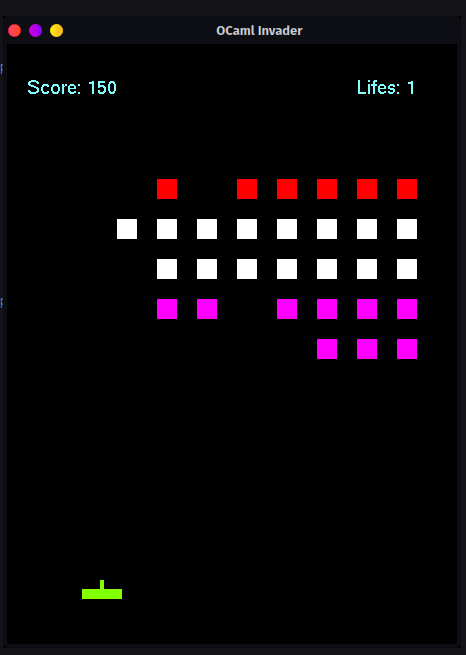
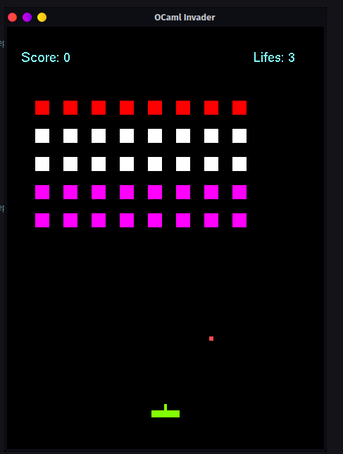
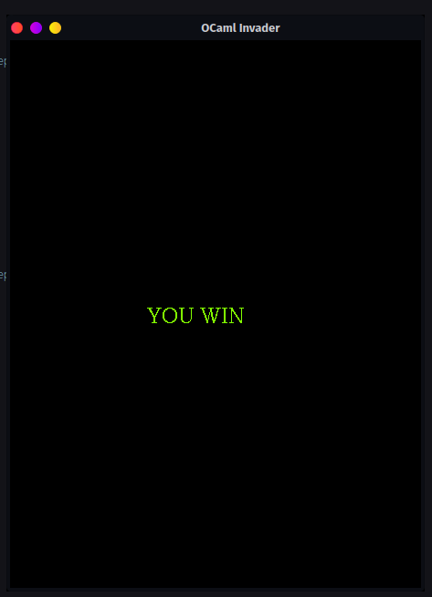

# OCaml Invaders

## Simple space invaders game to get more familiar with ocaml and open gl. Super simple and to the point :-)

### Setup

This project uses opam with dune. Make sure you have labgl installed with opam

### Running

dune exec ocaml_invader

#### Screenshots

